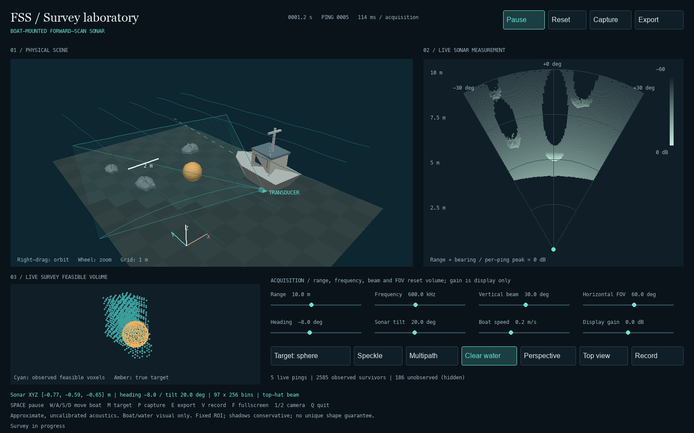
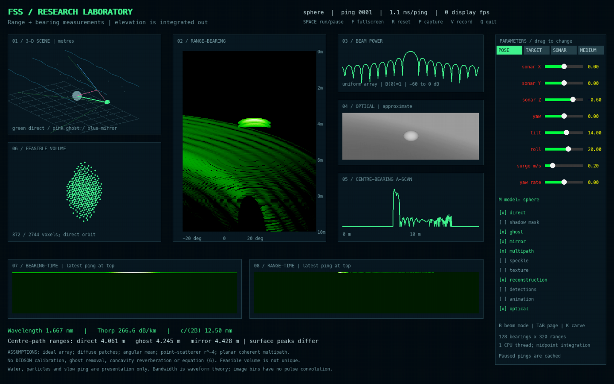

# Forward-scan sonar laboratory

## Boat-mounted survey laboratory

Run `./launch_survey.command` for a boat-mounted 3-D scene, synchronized live
2-D sonar and a feasible volume accumulated from the actual survey pings.
Includes sphere, cylinder, pipe and wreck targets, pose and acoustic controls,
transparent water, camera orbit, screenshot/data export and PNG recording.
See [controls and scientific boundaries](docs/survey_lab.md).



## Original research console


*A synchronized scene, range-bearing image, beam response, optical view and raw-data diagnostics; presentation effects are separate from acoustic measurements.*

An undergraduate research-learning simulator exploring the elevation ambiguity
of forward-scan sonar, first-hit shadows, simplified multipath, speckle and
known-pose feasible-volume reconstruction. Built with AI coding assistance while
testing the models and learning their assumptions. Not calibrated DIDSON imagery,
institutionally endorsed work, or an exact reproduction of a research paper.

## Animated Mac preview and Unreal source

An additional [3-D observatory preview](python/observatory_3d.py) uses the same C++
model in a native animated interface. On this Mac, run `./launch_observatory.command`.
The [Unreal project](unreal/AbyssSonar/README.md) is source-only until Unreal Engine
and full Xcode are installed and its engine build is verified. See the
[validation and progress report](docs/mac3d_progress.md) for exact results and limits.

## Install, build and launch

C++17 compiler, CMake 3.20+, and Python 3.9+ are required. From the project root:

```bash
python3 -m venv .venv
.venv/bin/python -m pip install -r requirements.txt
.venv/bin/python setup.py build_ext --inplace
.venv/bin/python python/research_console.py
```

On the existing workstation `.venv` is a pre-existing symlink to another project;
it is preserved. The clean baseline was independently rebuilt in
`/Users/gregsobe/sonar_sim_integration_20260908/.venv`. To avoid reusing a linked
environment in a new installation, create a differently named venv and pass its
interpreter as `SONAR_PYTHON` when reproducing.

CMake builds the C++ library separately. It does **not** refresh the Python extension:

```bash
cmake -S . -B build_cmake
cmake --build build_cmake
ctest --test-dir build_cmake --output-on-failure
.venv/bin/python -c 'import sonar; print(sonar.__file__)'
```

Run all validation, demonstrations and notebook cells into a fresh directory:

```bash
make reproduce
# or
./run_all.sh
# With another environment:
SONAR_PYTHON=/absolute/path/to/venv/bin/python ./run_all.sh
```

Each run gets `results/YYYY-MM-DD_HHMMSS_microseconds/`, a manifest, complete
source snapshot, per-stage logs, forced Cython rebuild, fresh CMake build, tests,
all 21 demos, executed notebook and simulator screenshots. Failure leaves a
FAIL manifest and logs. It never overwrites a previous run. Jupyter needs local
kernel sockets, so restrictive execution sandboxes may require permission.

## Architecture

```mermaid
flowchart LR
    A[OBJ and analytic targets] --> B[C++17 intersections]
    B --> C[First-hit elevation average]
    C --> D[Raw range-bearing intensity]
    D --> E[Python experiments and Pygame]
    D --> F[Highlight / feasible-shadow masks]
    F --> G[C++ voxel consistency]
    H[C++ chirp and matched filter] --> I[Waveform validation and WAV]
    B --> J[Separate optical camera]
    D --> K[Sonar features and descriptors]
    L[C++ planar IMU] --> M[C++ robust SE(2) pose graph]
    K --> M
    M --> N[Trajectory, map and covariance]
    O[External GPL BELLHOP] --> P[Ray and arrival parser]
    P --> Q[Reciprocal two-way path pairs]
    Q --> R[BELLHOP-coupled FSS image]
```

Cython exposes `SonarSimulator`, `OpticalCamera`, `ChirpSonar`, OBJ geometry,
projection and carving. Python handles experiments, masks, correlation, plots,
confidence intervals and presentation. No external asset service is required.
Procedural meshes have provenance, units and topology checks in
[assets/manifest.json](assets/manifest.json).

## Eigenray multipath: surface and seabed boundaries

Multipath is built by the image method: reflecting the sonar through a flat
boundary turns one bounce into a straight line, the same equivalence
[BELLHOP](https://oalib-acoustics.org/) and the rest of the Acoustics Toolbox
use for a range-independent duct. Two boundaries are modelled this way, each
producing its own ghost (one leg direct, one bounced) and mirror (both legs
bounced) component, gated on the two real-space legs actually being clear of
the scene rather than assumed visible:

| Boundary | Reflection model | Config |
|---|---|---|
| Sea surface | Pressure-release amplitude (`surface_reflectivity`, 1 for calm), reduced by Ogilvy roughness scattering | `multipath_enabled`, `surface_z`, `surface_rms_height_m` |
| Seabed | Rayleigh two-fluid coefficient from a real density/sound-speed contrast, with a critical grazing angle below which it reflects totally | `bottom_enabled`, `bottom_z`, `bottom_speed_mps`, `bottom_density_kgm3`, `bottom_rms_height_m` |

The critical grazing angle, `acos(speed_of_sound_mps / bottom_speed_mps)`, is
the same cutoff BELLHOP's ray trace shows over a fast bottom: shallower rays
reflect totally, steeper ones start losing energy into the sediment. See
[core/physics.h](core/physics.h) for the closed form and
[demo18](python/demo18_bottom_multipath.py) for a fixed-geometry sweep across
it, checked against the closed form directly rather than just plotted next to
it. This is still a flat-boundary, single-bounce-per-boundary model, not a
sound-speed-profile ray trace: refraction, higher-order surface/bottom
combinations and coherent phase summation remain future work, tracked in
[the implemented/approximated/missing table](#implemented-approximated-and-missing)
below and in
[docs/eigenray_multipath_20260913.md](docs/eigenray_multipath_20260913.md).

## Acoustics Toolbox propagation laboratory

Run `./launch_bellhop.command` for an interactive range-depth propagation view
driven by the **actual compiled Fortran BELLHOP solver**. Releasing a slider
writes a new `.env` file, executes BELLHOP twice, parses its ASCII `.ray` and
`.arr` products, and redraws the ray fan and monostatic two-way returns. Press
`T` to switch between two-way object/ghost/mirror ranges and one-way arrivals.
The controls expose frequency, water depth, source and receiver depth, range,
linear sound-speed profile, sediment sound speed/density, launch aperture and
ray count. Direct, surface, bottom and combined-bounce paths are separated by
colour.

The supplied Acoustics Toolbox and PYAT archives are GPL-3.0. Their source is
not copied into this MIT repository: BELLHOP remains an external process, and
the environment writer and parsers here are an independent adapter. On macOS,
build the external solver from the user-supplied archive with:

```bash
./scripts/install_bellhop_macos.sh /path/to/atWin10_2020_11_4.zip
```

The adapter checks `BELLHOP_EXECUTABLE`, then the default installation under
`~/.local/opt/acoustics-toolbox-2020/`. The checked installation generated 241
rays and ten far-range arrivals in the default environment. With a constant
1500 m/s profile, its 120 m direct arrival was 0.0799999982 s versus the
analytic 0.08 s, a relative difference of 2.25×10⁻⁸. Demo 21 couples the
geometric FSS image to reciprocal BELLHOP paths. At an 80 m target its first
object, mixed-path ghost and reflected-path mirror returns were 80.20 m,
80.99 m and 81.78 m. The coupling uses a configured target depth and incoherent
intensity addition; it is not a broadband coherent pressure simulation. See
[the propagation workflow and boundary](docs/bellhop_lab.md).

## Planar sonar–inertial SLAM

Run `./launch_slam.command` to open the animated SLAM Laboratory. A synthetic
vehicle completes a 37-ping closed survey while the C++ planar IMU accumulates
bias and noise. Local maxima extracted from the actual rendered beam-bin images
form scan features; coarse scan descriptors propose old frames, mutual-nearest
ICP verifies their relative transform, and a Huber-robust C++ Gauss–Newton pose
graph combines IMU, consecutive scan and loop-closure constraints. The final map
is made by transforming those sonar features with the optimized poses, and the
display includes marginal position uncertainty from the inverse information
matrix. On the fixed seeded experiment, loop closure reduces trajectory RMSE
from 0.987 m to 0.149 m and endpoint closure error from 1.154 m to 0.0015 m.

This is an honest SE(2) research-learning system. It anchors the first pose to
define the coordinate frame and uses ground truth only for the reported error.
It does not estimate depth, roll, pitch, IMU biases or clock offsets, and it has
not been calibrated on real navigation data. It therefore demonstrates the
sonar-aiding structure motivated by RUSSO rather than reproducing RUSSO's stereo
camera, IMU and sonar 6-DoF estimator.
See [the model, equations, research questions and limitations](docs/slam.md).

## Console controls

The four parameter pages are POSE, TARGET, SONAR and MEDIUM. Drag a slider; click
a toggle. TAB cycles pages. A paused ping is cached. Physical platform motion
uses elapsed seconds, not frames. Scene orbit changes presentation only.

| Key | Action |
|---|---|
| Space | Run/pause platform and new pings |
| F | Fullscreen/windowed |
| R | Reset parameters and history |
| M | Sphere, box, coral-like rock, pipe, concave table |
| B | Uniform array, top-hat, Hann |
| K | Acquire a synthetic known-pose orbit and carve a feasible volume |
| P | Save screenshot under `results/console_*/` |
| V | Start/stop a bounded GIF recording |
| Q / Escape | Quit |

Pose controls move/rotate the sonar; target controls move/scale/rotate the object;
frequency, beamwidth, FOV and sub-rays change image formation. Gain and dynamic
range change display only. Surface height, RMS roughness and multipath amplitude
control the approximate reflection model. Correlation controls speckle cell size;
turbidity affects only the camera. Voxel size, pose count and threshold affect
carving. Bandwidth reports c/(2B) waveform theory; it does not sharpen image bins.

The original Pygame console (`python/console.py`), matplotlib front end
(`python/simulator_app.py`) and original demo names remain available. The
research console is the recommended primary application. Historical behavior
and measurements are retained in [baseline_readme.md](docs/baseline_readme.md)
and the clean integration clone, not silently presented as current results.

## The model, with symbols

Range **r** is distance, bearing **θ** is left-right angle, and elevation **φ** is
up-down angle. **P** is the point [X, Y, Z], with X right, Y forward, Z up:

\[
P=r[\cos\phi\sin\theta,\cos\phi\cos\theta,\sin\phi].
\]

Only r and θ select a pixel. Elevation is integrated over multiple first-hit
rays. Symmetric +φ and −φ targets can therefore give the same image.

**R** is reflectivity, **n** the surface normal, **u** the outgoing ray, and **TL**
the two-way absorption loss in decibels:

\[
I=R\max(0,n\cdot(-u))r^{-4}10^{-TL/10}.
\]

The r⁻⁴ factor is a point-scatterer spreading approximation. **α** is absorption
in dB/km, **f** is frequency in kHz, and **r_km** is range in kilometres:

\[
\alpha=\frac{0.11f^2}{1+f^2}+\frac{44f^2}{4100+f^2}+2.75\times10^{-4}f^2+0.003,
\qquad TL=2\alpha r_{km}.
\]

**λ** is wavelength c/f, **N** is element count, and **d** is spacing:

\[
B(\phi)=\left[\frac{\sin(N\pi d\sin\phi/\lambda)}{N\sin(\pi d\sin\phi/\lambda)}\right]^2,
\qquad B(0)=1.
\]

The default normalized midpoint average avoids increasing raw intensity merely
by increasing sample count. `legacy_elevation_sum=True` reproduces the original
unnormalized endpoint sampling. Neither is calibrated received watts.

Direct distance is **r_d**, reflected-leg distance **r_m**, and the mixed-path
ghost range **r_g=(r_d+r_m)/2**. The mirror is deposited at its own bearing.
For roughness **σ_h**, grazing angle **g**, and wavenumber **k=2π/λ**, coherent
amplitude is **γ=exp[−(2kσ_h sin g)²/2]**. This is a simplified attenuation,
not complete rough-surface scattering or ghost removal.

The seabed boundary uses the same **r_d**, **r_m**, **r_g** construction with
its own z, but a real reflection coefficient in place of the surface's assumed
-1. With **c₁,ρ₁** the water and **c₂,ρ₂** the sediment, impedance
**Z=ρc**, and Snell's law in grazing form **cos(g)/c₁=cos(g₂)/c₂**:

\[
R(g)=\frac{Z_2\sin g-Z_1\sin g_2}{Z_2\sin g+Z_1\sin g_2},\qquad
\sin g_2=\sqrt{1-\left(\frac{c_2}{c_1}\cos g\right)^2}.
\]

Below the critical grazing angle **g_c=\arccos(c_1/c_2)** (only possible when
the sediment is faster), sin g₂ has no real solution and the boundary reflects
totally, \|R\|=1. **R** is squared once per leg like the surface's γ, so the
ghost carries R² and the mirror R⁴; its sign (a phase this simulator does not
track, since multipath is summed as incoherent intensity) is discarded.
Both boundaries' reflected legs are now occlusion-checked against the scene
before either bounce is deposited, not just assumed clear.

Speckle multiplies intensity by **−ln(U)** for uniform random U. A single-look
exponential intensity has standard deviation approximately equal to its mean.
The correlated mode filters complex Gaussian amplitude before squaring.

The waveform uses **r=ct/2**, and bandwidth **B** gives approximate resolution
**c/(2B)**. A 60 kHz chirp at c=1500 m/s gives 12.5 mm. The image renderer has
independent range-bin spacing and no finite-pulse convolution. WAV exports are
slowed educational playback, not directly audible MHz sound.

## Validation and experiments

[Scientific status](docs/scientific_status.md) and the
[integration audit](docs/integration_audit.md) describe validation and known limits.
Baseline checks agreed with plane-intensity theory to
2.28×10⁻¹⁶ relative error, speckle contrast was 0.9999, and the compressed
half-power width was 11.06 mm versus 11.08 mm predicted. These are synthetic or
analytic checks, not evidence of real-ocean accuracy.

| Demonstration | Command |
|---|---|
| Elevation ambiguity / two physical scenes | `.venv/bin/python python/demo1_ambiguity.py` |
| Sphere on seabed / full shadow range | `.venv/bin/python python/demo2_shadow.py` |
| Intensity versus range | `.venv/bin/python python/demo3_validation.py` |
| Speckle distribution | `.venv/bin/python python/demo4_speckle.py` |
| Target motion | `.venv/bin/python python/demo5_motion.py` |
| Multipath versus roll | `.venv/bin/python python/demo6_multipath.py` |
| Animated sweep | `.venv/bin/python python/demo7_animation.py` |
| Optical-sonar fusion | `.venv/bin/python python/demo8_optiacoustic.py` |
| Signature and shadow height | `.venv/bin/python python/demo9_target.py` |
| Motion validation | `.venv/bin/python python/demo10_motion.py` |
| Texture and speckle | `.venv/bin/python python/demo11_texture.py` |
| Chirp, matched filter and audio | `.venv/bin/python python/demo12_chirp.py` |
| Original fusion Monte Carlo | `.venv/bin/python python/demo13_montecarlo.py` |
| Four renderers, meshes, beams, convergence | `.venv/bin/python python/demo14_renderers.py` |
| Carving and five degradation sweeps | `.venv/bin/python python/demo15_carving.py` |
| Known-point recovery and conditioning | `.venv/bin/python python/demo16_point_recovery.py` |
| Separate multipath components / roughness | `.venv/bin/python python/demo17_multipath_components.py` |
| Seabed critical-angle multipath sweep | `.venv/bin/python python/demo18_bottom_multipath.py` |
| Planar sonar–IMU SLAM and loop closure | `.venv/bin/python python/demo19_slam.py` |
| External BELLHOP rays and arrival-time validation | `.venv/bin/python python/demo20_bellhop.py` |
| BELLHOP-coupled two-way FSS object/ghost/mirror | `.venv/bin/python python/demo21_bellhop_fss.py` |

Every demo runs from the root, saves output, and shares the C++ core. Set
`SONAR_OUTPUT_DIR` for a chosen destination; otherwise standalone demos use
`output/`. The reproduction command always creates a fresh directory.

## Implemented, approximated and missing

| Area | Status |
|---|---|
| Analytic geometry, OBJ triangles, projection | Implemented, tested |
| Elevation response, diffuse brightness, shadows | Implemented approximations, analytically checked |
| Multipath / roughness | FSS renderer: flat image-method surface/seabed paths with leg occlusion and Rayleigh seabed reflection. Propagation lab: external BELLHOP rays/arrivals and fixed-target-depth incoherent two-way image coupling |
| Correlated speckle and voxel hull | Implemented synthetic experiments; segmentation dependent |
| Point recovery | Known-correspondence least squares and sensitivity experiments |
| Sonar–inertial SLAM | Planar IMU, image features, descriptor proposals, ICP verification, robust SE(2) pose graph, map and marginal covariance; synthetic closed-loop validation |
| Equation (6), ICP/IRLS patch motions | Unimplemented; no proxy is labeled as equation (6) |
| Real DIDSON and ocean calibration | Unimplemented |

Read the complete [scientific status](docs/scientific_status.md) and
[paper mapping](docs/paper_mapping.md). Key limitations include ideal array
response, diffuse material coefficients, point-scatterer spreading, incomplete
sonar equation, flat single-bounce-per-boundary live multipath; the separate
BELLHOP coupling has sound-speed refraction but no coherent phase or per-patch
target depth; no full concavity
reverberation, independent speckle unless correlation is selected, known poses
for carving, planar-only synthetic SLAM,
segmentation-dependent carving and non-unique feasible hulls. Synthetic truth
is not a substitute for real-data validation.

## Research preparation

Start with the [elementary study guide](docs/study_guide.md), then run
[the narrative notebook](notebooks/sonar_story.ipynb) after reproduction.
Show **elevation ambiguity first**, then **multi-view carving**. Use the shadow
and multipath figures to explain the limitations rather than promising exact
3-D geometry.

Verified references: Aykin & Negahdaripour's diffuse image model (JOE, July
2016, DOI 10.1109/JOE.2015.2503818), their space-carving paper (JOE, July 2017,
DOI 10.1109/JOE.2016.2591738), and Liu & Negahdaripour's ghost-removal framework
(Remote Sensing, 14 October 2024, DOI 10.3390/rs16203814). Links and the
implemented/omitted distinction appear in the paper mapping. The requested IEEE
document 8516375 remains identity-unverified due to publisher access restrictions.

The eigenray multipath above follows the Acoustics Toolbox family (BELLHOP,
KRAKEN, SCOOTER, RAM) and Attia et al.'s *Towards Realistic 3D Sonar
Simulation* (arXiv:2606.06130), which argues that GPU-rate sonar simulators
need exactly this kind of physically grounded propagation -- refraction,
scattering, and multipath -- and names those classical solvers as the
reference to build toward. The external BELLHOP laboratory now performs a
sound-speed-profile ray trace and limited two-way FSS coupling; KRAKEN normal
modes and coherent broadband target scattering remain absent. See
[docs/eigenray_multipath_20260913.md](docs/eigenray_multipath_20260913.md)
for exactly what was and was not implemented.

For scale, NSWC PCD's [MASTODON](https://github.com/Sonar-Sim/MASTODON) is a
general acoustic simulation toolset whose public setup explicitly requires a
real BELLHOP executable. This project now invokes BELLHOP as an external process
for its propagation lab and coupled demo; its real-time renderer still uses a
flat-boundary approximation. The exact distinction is recorded in
[the paper mapping](docs/paper_mapping.md#mastodon-comparison).

MIT license, Copyright (c) 2026 Gregory German. See [LICENSE](LICENSE).
