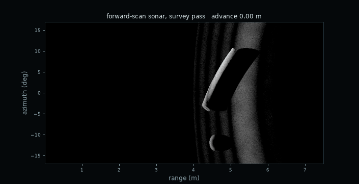

# Forward-Scan Sonar Simulator



*A simulated survey pass: the bright flank of a cylinder lying on the seabed, the
sharp acoustic shadow it throws, and a rock beside it, every frame rendered by the
C++ core.*

A physically grounded imaging-sonar simulator. C++ core, Cython bindings, Python
for scenes and demos.

## The physics

**Geometry.** A 3-D point in the sonar frame, with `Y_s` along the acoustic axis,
`Z_s` up and `X_s = Y_s × Z_s`:

```
P = r * [cos(phi) sin(theta), cos(phi) cos(theta), sin(phi)]
```

The image is addressed by `(range, azimuth)` only. `phi` is never used to place a
return, which is the elevation ambiguity.

**Beam integration.** Each azimuth bin is swept by `num_elevation_subrays`
sub-rays spanning `-beta/2 .. +beta/2`, weighted by the array factor

```
B(phi) = [ sin(N_e * pi * d * sin(phi) / lambda)
           / (N_e * sin(pi * d * sin(phi) / lambda)) ]^2
```

with `lambda = speed_of_sound_mps / frequency_hz`, `N_e = array_element_count`,
`d = array_element_spacing_m` (defaulting to `lambda/2`).

**Intensity.** At each sub-ray's first hit:

```
I = R * cos(incidence_angle) / r^4 * 10^(-TL/10)
TL = 2 * alpha * (r / 1000)
```

**Absorption**, Thorp's formula, `f` in kHz, result in dB/km:

```
alpha = 0.11 f^2/(1 + f^2) + 44 f^2/(4100 + f^2) + 2.75e-4 f^2 + 0.003
```

**Shadowing** is not implemented as a step. A sub-ray stops at its first surface
and contributes to no bin beyond it, so occlusion is what remains.

**Speckle**, optional: `I_observed = I_true * (-ln U)`, `U ~ Uniform(0,1]`. Single-look
intensity is exponential about its mean, so this is the exact distribution.

**Sea-surface multipath**, optional. The bounced leg has the same length and
launch direction as the straight line to the sonar mirrored through the surface,
so one reflection gives both extra components:

```
object   out direct, back direct    r_d
ghost    one leg each way           (r_d + r_m) / 2
mirror   both legs bounced          r_m
```

A rough surface scatters part of the field out of the specular direction, so the
coherent reflection falls with the Rayleigh parameter

```
R_a = 2 k sigma_h sin(grazing),   coherent amplitude  exp(-R_a^2 / 2)
```

The ghost bounces once and the mirror twice, so the mirror dies as the square.

**Textured backscatter**, optional. Real seabed is mottled: the local backscatter
strength varies patch to patch by several dB. Each surface carries a band-limited
noise field, three octaves of trilinear value noise hashed from the lattice, that
multiplies its reflectivity:

```
R(P) = R_0 * (1 + amplitude * 2 * (fBm(P / scale) - 0.5))
```

It is a function of the world point, so it is identical from every viewpoint.
That is the whole difference from speckle, which is redrawn per realisation, and
it is what any registration or patch-motion estimate has to lean on.

**Optical camera.** A pinhole camera sharing the sonar's frame convention, for
the elevation the sonar cannot measure. Underwater the direct term is attenuated
over both legs and spreads as `1/r^2` while the water scatters a veiling glow
back that grows with range:

```
L = J * R * cos(incidence) * exp(-2 c r) / r^2  +  B_inf * (1 - exp(-c r))
```

with `c` the beam attenuation coefficient and `J` the vehicle light. Raise `c`
and the second term buries the first.

**Platform motion during a sweep.** Bearing bin `a` is formed at
`t_a = T (a + 1/2) / N_theta` and rendered from the pose at that instant, so an
image taken while the vehicle surges or yaws is a set of measurements from
`N_theta` slightly different places pasted into one grid. Setting
`sweep_duration_s = 0` freezes the platform and reproduces the static sensor
exactly.

**Pulse compression**, in a separate layer. `core/waveform.{h,cpp}` simulates the
raw time-domain acoustics rather than forming an image. A linear FM chirp

```
s(t) = cos(2 pi (f0 t + (B / 2T) t^2)),   t in [0, T]
```

sweeps `B` hertz over `T` seconds. Each reflector contributes that waveform
delayed by `tau = 2 r / c` and scaled by the pressure amplitude of the same
intensity model the imaging pipeline uses, `sqrt(R cos(theta) / r^4)` with Thorp
absorption, so both layers agree on how loud a return at range `r` should be.
Gaussian noise is added, and the record is correlated against the transmitted
copy. That compresses each echo to a pulse of width about `1/B`, giving

```
delta_r = c / (2 B)
```

independent of `T`, against `c T / 2` for a plain pulse of the same length. The
improvement is the time-bandwidth product `B T`. This is standard pulse
compression: Urick, *Principles of Underwater Sound*, 3rd ed., ch. 2 and 9.

At f0 = 300 kHz, B = 60 kHz, T = 2 ms the chirp resolves 12.5 mm where the plain
pulse resolves 1.5 m, a factor of 120. Measured on one noise-free target, the
compressed half-power width is 11.06 mm against the `0.886 c / (2 B)` = 11.08 mm
a sinc envelope predicts, 0.2% low. Two targets 50 mm apart come back at
-0.62 mm and +0.63 mm, inside one sample.

The layer is deliberately independent: nothing in it writes into a beam-bin
image, and nothing in the render path calls it. The only shared code is
`physics.h`.

**Monte Carlo evaluation.** Anything that depends on a noise draw is reported
over many independently seeded runs, not from one realisation. Speckle has
contrast 1, so a single run can land anywhere. `python/montecarlo.py` computes
means, standard deviations and percentile bootstrap intervals; the bootstrap is
used rather than a t interval because these errors come from a centroid on a
thresholded blob, which is a nonlinear function of the noise and not obviously
Gaussian. `N` and the confidence level are set by `SONAR_MC_TRIALS` and
`SONAR_MC_CONFIDENCE`, defaulting to 200 and 0.95. The repeated trials call the
same `recovery.py` functions the single run does.

## Performance

The core threads over bearing and is bit-for-bit identical to the serial result,
which `tests/test_units.py` checks in both the independent-bearing case and the
multipath case where a bearing deposits into a neighbour's column. Measured on
this machine, one 193x700 frame with a seabed and a sphere:

| sub-rays | multipath | before | after | speedup |
|---|---|---|---|---|
| 512 | off | 6.46 ms | 0.52 ms | 12.4x |
| 512 | on | 10.28 ms | 1.48 ms | 6.9x |
| 3072 | off | 34.59 ms | 2.38 ms | 14.5x |
| 3072 | on | 61.43 ms | 5.98 ms | 10.3x |

About 1.8x of that is scalar: the elevation sub-ray table, `cos`, `sin` and
`B(phi)`, is built once per frame instead of once per bearing, and
`10^(-TL/10) / r^4` became one `exp` and three multiplies instead of two `pow`
calls. The rest is the threads. The two renders agree to 2.2e-16 relative, one
unit in the last place, which is the `exp` against the `pow`.

The interactive app went from 62 ms to 44 ms a frame while gaining a camera panel
and three more sliders, by making the artists once and blitting them over a
cached background instead of clearing and rebuilding the axes every frame. Held
sliders render a draft frame at 224 sub-rays and the release renders at 1536.

## Build

```
python3 -m venv .venv && .venv/bin/pip install numpy matplotlib cython setuptools
.venv/bin/python setup.py build_ext --inplace
```

`cmake -S . -B build && cmake --build build` builds the core as a static library
on its own, which is useful for checking the C++ compiles without Python.

## Layout

```
core/       C++: geometry.{h,cpp} intersections and surface texture,
            physics.{h,cpp} beam pattern and absorption, simulator.{h,cpp} the
            threaded sub-ray imaging loop, camera.{h,cpp} the pinhole camera,
            waveform.{h,cpp} the chirp, echo record and matched filter
bindings/   sonar.pyx, the SonarSimulator and OpticalCamera classes, test hooks
python/     scene.py and acoustics.py helpers, and the twelve demos
tests/      test_units.py, analytic checks
output/     everything the demos write
```

## Running everything at once

```
./run_all.sh          # or: make reproduce
```

Builds the extension, runs the test suite, then runs every demo in order, writing
into a fresh `results/<timestamp>/` directory so runs accumulate rather than
overwriting each other. Demos take their destination from `SONAR_OUTPUT_DIR` via
`python/outputs.py`, defaulting to `output/` when run individually.

`notebooks/sonar_story.ipynb` is the same story as a narrative notebook, with the
figures inline and the WAV files as playable audio widgets. It runs top to bottom
and reads its figures from the newest `results/` directory, falling back to
`output/`. It needs `nbclient`, `ipykernel` and `nbformat` on top of the runtime
dependencies, or just Jupyter.

## Running individual pieces

```
.venv/bin/python python/simulator_app.py       # interactive, sliders and toggles
.venv/bin/python tests/test_units.py           # 43 analytic checks
.venv/bin/python python/demo1_ambiguity.py     # output/demo1_ambiguity.png
.venv/bin/python python/demo2_shadow.py        # output/demo2_shadow.png
.venv/bin/python python/demo3_validation.py    # output/demo3_validation.png
.venv/bin/python python/demo4_speckle.py       # output/demo4_speckle.png
.venv/bin/python python/demo5_motion.py        # output/demo5_motion.png and .txt
.venv/bin/python python/demo6_multipath.py     # output/demo6_multipath.png
.venv/bin/python python/demo7_animation.py     # output/demo7_roll_sweep.gif
.venv/bin/python python/demo8_optiacoustic.py  # output/demo8_optiacoustic.png
.venv/bin/python python/demo9_target.py        # output/demo9_target.png
.venv/bin/python python/demo10_motion.py       # output/demo10_motion.png
.venv/bin/python python/demo11_texture.py      # output/demo11_texture.png
.venv/bin/python python/demo12_chirp.py        # output/demo12_chirp.png and 3 WAV files
.venv/bin/python python/demo13_montecarlo.py   # output/demo13_montecarlo.png
```

`simulator_app.py` is the console: a bearing-power trace over a compass and
relative bearing scale, the beam-bin image with detections marked, an A-scan and
an optical trace, and two time records, bearing-time and range-time, that fill as
the platform runs. Sliders for tilt, roll, beamwidth, frequency, target range,
heading, sea-surface roughness, turbidity, seabed texture, surge and yaw rate,
with multipath, speckle, cylinder-target and run toggles. Every frame is rendered
by the C++ core, so it is the simulator itself rather than a separate model
behind a nicer front end. It needs an interactive matplotlib backend; the demos
above are all headless.

On frame budget: the core takes 5 to 10 ms a frame and matplotlib's image
compositing takes the rest, about 58 ms in total on this machine. Measured by
hiding artists, the three waterfall panels account for 20 ms, 7 ms and 7 ms of
that, and the remaining 27 ms is lines, text and the blit. Holding a slider
renders a draft frame at 192 sub-rays and releasing renders at 1280.

| demo | what it shows |
|---|---|
| 1 | A target at `+phi` and at `-phi` render identically to 1.1e-15 of peak. Asserts and prints pass/fail. |
| 2 | A sphere on the seabed casting a shadow, with 5.0% of the energy beyond it removed. |
| 3 | A plane swept 1 to 10 m against the analytic intensity equation. Relative error 0. |
| 4 | Speckle off and on, with the measured distribution against `exp(-x)`. |
| 5 | Four poses along two survey lines, showing cross-range motion cannot separate `+/-phi` and vertical motion can. |
| 6 | Sea-surface multipath. The ghost rides on every view; the mirror only appears once roll moves it into the beam. |
| 7 | An animated roll sweep written to a GIF, every frame from the C++ core. |
| 8 | Opti-acoustic fusion. One sonar bin leaves 98 cm of arc open; crossing it with the camera's detection pins the target to 2.4 cm, and the turbidity sweep shows where the camera quits and the sonar does not. |
| 9 | A cylinder's highlight-and-shadow signature against a rock, and the height recovered from the shadow length to 0.8 to 3.1 cm over 0.12 to 0.46 m. |
| 10 | Surge and yaw inside one sweep, with every displacement predicted from geometry first and then measured off the image; they agree to 0.07 deg and 10 mm. |
| 11 | Texture survives a 5 cm move at r = 0.996 and speckle does not at r = 0.006, with a multilook curve for how many looks registration needs. |
| 12 | Pulse compression. Compressed width 11.06 mm against 11.08 mm theory; two targets 50 mm apart recovered to 0.6 mm by the chirp and merged into one by a plain pulse of the same duration. Writes playable WAV files. |
| 13 | Monte Carlo. Every noisy result as a distribution over 200 independently seeded trials, with bootstrap confidence intervals, plus the camera-baseline sweep with a confidence band. |

## Engineering choices worth knowing

**`B(phi)` in elevation.** The array-factor formula is conventionally the pattern
along the *beamformed* axis, which for a forward-scan sonar is azimuth, not
elevation: an FSS does not beamform vertically, which is why elevation is
ambiguous at all. Applied across elevation it acts as a vertical aperture taper.
It is even in `phi` either way, so the ambiguity is untouched by the choice.

**Sub-ray count.** The default is 48. That is ample for a compact target and badly
short for a seabed at grazing incidence, where one beam spreads over hundreds of
range bins. Measured fraction of seabed bins receiving any energy: 14.7% at 48,
59.9% at 192, 99.9% from 768 up, with bin-to-bin scatter settling only near 3000.
The seabed demos use 3072, which costs 0.04 s a frame.

**Odd azimuth bin count in demo 3.** With an even count the bin centres straddle
boresight and the nearest beam sits at 0.23 degrees, so the ray strikes at
`r/cos(theta)` with `cos(incidence) = cos(theta)`. That alone puts the validation
4e-5 off. An odd count places one beam exactly on axis and the agreement becomes
exact.

**Demo 1 asserts a tolerance, not bitwise equality.** For the `+phi` target the
sub-ray that strikes it is `s`; for `-phi` it is `n-1-s`. The contributions
accumulate in reverse order and floating-point addition is not associative, so
the images agree to 1.1e-15 rather than bit for bit.

**Mirror gating.** An early version dropped the ghost whenever the mirror fell
outside the vertical beam, because both were behind one test. The ghost has two
reciprocal paths and the one that leaves direct and returns bounced still arrives
on the object's bearing, so it survives when the mirror does not. Fixing that is
what reproduces the observation that almost every view carries a ghost while only
some carry a mirror.

**Mirror azimuth.** The mirrored arrival is deposited at its own azimuth bin, not
the cast ray's. Without that, roll cannot move the mirror in bearing, which is the
whole mechanism by which a rolled sonar sees a mirror an unrolled one cannot.

**Opti-acoustic geometry.** A co-located camera would resolve elevation on its
own, since it measures the angle directly. The camera here is mounted 30 cm above
the sonar, which is the realistic case and makes the arc project to a curve
rather than a point. The residual 2.4 cm is dominated by the sonar measuring the
target's near surface while the camera centroids its whole disc, one radius
apart; demo 8 prints the number both with and without that correction.

**Motion is a warp, not a blur.** Each bearing here is a single instant, so a
compact target stays sharp and simply lands in the wrong place. Real blur needs
finite dwell inside one bin. The visible smear comes from extended targets, where
neighbouring bearings are displaced by different amounts and a straight edge is
sheared. This also assumes a mechanically scanned head; a multibeam fan forms
every bearing from one ping and is frozen within it, so the same distortion shows
up between pings when images are mosaicked instead.

**Fan magnification under yaw.** Sweeping at `FOV/T` while the head turns at
`omega` scales the fan by `FOV / (FOV -+ omega T)`, 1.545 at 30 deg/s over 0.4 s.
The measured 1.520 sits 1.7% off because the yaw is about world `Z` and the head
is tilted, so it is not a pure bearing rotation in the sonar's own frame.

**Audio.** The demo writes the transmitted chirp, the received record and the
matched-filter output as WAV files, resampled onto a time base 600 times longer.
That divides every frequency by 600 and leaves the waveform's shape untouched, so
the 300 kHz carrier lands at 500 Hz and the files play directly.

## Not modelled

Volume reverberation, a transmit pulse of finite length (the range point spread is
a delta), refraction, incoherent scatter from the rough surface (energy lost from
the coherent reflection simply disappears rather than becoming diffuse
reverberation), and any frequency dependence of reflectivity. The texture field
is band-limited noise rather than a K or lognormal draw with a measured seabed
spectrum, and the camera has no lens blur, no vignetting and no sensor noise.

## References

The forward-scan geometry, the beam-bin image formation and the sea-surface
ghost and mirror model follow:

- Y. Liu and S. Negahdaripour, "Ghost Removal from Forward-Scan Sonar Views near
  the Sea Surface for Image Enhancement and 3-D Object Modeling," *Remote
  Sensing* **16**(20), 3814, 2024. https://doi.org/10.3390/rs16203814

The sonar equation, Thorp's absorption coefficient and pulse compression follow:

- R. J. Urick, *Principles of Underwater Sound*, 3rd ed., McGraw-Hill, 1983,
  ch. 2 and 9.

Related work by the same group on diffuse image formation and on space carving
from forward-scan views:

- M. D. Aykin and S. Negahdaripour, IEEE *Journal of Oceanic Engineering*
  **41**(3), 569-582, 2016.
- M. D. Aykin and S. Negahdaripour, IEEE *Journal of Oceanic Engineering*
  **42**(3), 574-589, 2017.

## License

MIT. See [LICENSE](LICENSE).
