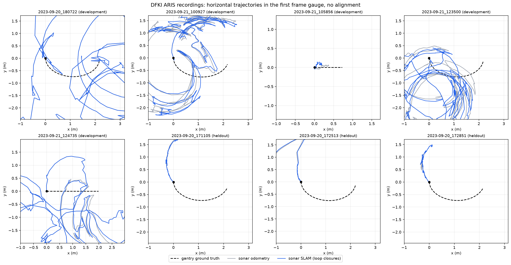
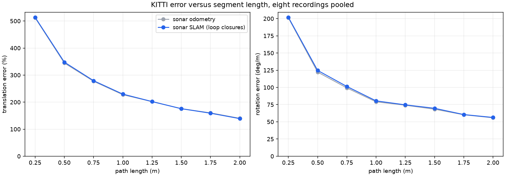

# Sonar odometry on the public DFKI ARIS recordings, KITTI form (2026-09-18)

## Status
Not validated. On the eight public tank recordings with gantry ground truth
the planar sonar odometry has translation errors of 54 to 587 percent and
rotation errors of 5 to 183 deg/m, against a true rotation rate of about
50 deg/m (the gimbal pans 130 degrees while the crane moves 2.7 m). The
cause is known and measured below; it is the imaging geometry, not the
matcher. This folder exists so the sonar side is scored on public data in
the same form as the optical side, and so the failure is on record.

## Data
DFKI acoustic and optical UXO dataset (Dahn et al., OCEANS 2024, Zenodo
record 13778485): ARIS Explorer 3000 imaging sonar on a gantry crane in a
test tank, gantry position and gimbal angles as ground truth. Eight complete
recordings, 5,233 frames: five used for development on 2026-09-14 and three
selected by date before inspection (held out). Passes are 0.7 to 2.9 m at
5 cm/s with the sonar tilted 22, 42 or 60 degrees below horizontal and
panned through up to 130 degrees.

## Method and metric
The frozen trajectories from `SLAM/research/evaluate.py` (2026-09-14, stride
1): sequential ICP sonar odometry and the loop closed keyframe graph, carried
to every frame by the odometry. KITTI devkit segment errors at lengths 0.25
to 2.0 m (the 100 to 800 m set scaled by 1/400), start step one frame, plus
ATE after rigid SE(2) alignment and the stationary control. Pose files are
in KITTI layout under `results/`.

## Results

| Recording | Split | Tilt | Frames | Path (m) | Sonar odometry t / r / ATE | Sonar SLAM t / r / ATE | Stationary ATE |
|---|---|---:|---:|---:|---:|---:|---:|
| 2023-09-20_180722 | development | 42 | 751 | 2.85 | 587 % / 139.9 / 2.889 m | 587 % / 139.9 / 2.889 m | 0.756 m |
| 2023-09-21_100927 | development | 22 | 725 | 2.71 | 286 % / 119.6 / 1.279 m | 297 % / 123.5 / 1.349 m | 0.729 m |
| 2023-09-21_105856 | development | 60 | 220 | 0.72 | 54 % / 4.7 / 0.104 m | 79 % / 7.8 / 0.148 m | 0.211 m |
| 2023-09-21_123500 | development | 42 | 780 | 2.82 | 307 % / 148.7 / 1.378 m | 298 % / 147.1 / 1.353 m | 0.751 m |
| 2023-09-21_124735 | development | 60 | 592 | 1.98 | 425 % / 182.8 / 1.668 m | 426 % / 183.7 / 1.671 m | 0.575 m |
| 2023-09-20_171105 | held out | 22 | 715 | 2.67 | 169 % / 72.2 / 0.329 m | 164 % / 69.9 / 0.339 m | 0.722 m |
| 2023-09-20_172513 | held out | 22 | 741 | 2.83 | 204 % / 76.1 / 0.611 m | 202 % / 76.9 / 0.600 m | 0.753 m |
| 2023-09-20_172851 | held out | 22 | 709 | 2.67 | 139 % / 61.9 / 0.483 m | 152 % / 69.7 / 0.411 m | 0.723 m |

Translation in percent of segment length, rotation in deg/m, ATE in metres.
Pooled: development 394 % / 141.7 deg/m, held out 171 % / 70.2 deg/m. The
ATE values agree with the 2026-09-14 report (0.336, 0.602, 0.487 m held
out) to the third decimal; the KITTI segment metric is far harsher because
it scores every 0.25 to 2 m relative motion, where the earlier ATE compared
whole trajectories after alignment.





## Diagnosis
1. **Mirrored heading on the 22 degree recordings.** The three held out
   passes trace the gantry arc with the opposite curvature (figure above).
   Rescoring the same trajectories with the bearing axis reversed lowers
   their rotation error from 72, 76 and 62 deg/m to 11, 27 and 22 deg/m and
   the first pass's translation error from 169 to 27 percent. This is a
   diagnostic, not a correction: the physical bearing direction of the ARIS
   beam table has not been confirmed with an off axis target, and the same
   reversal does not help the steeper recordings.
2. **Planar model against a tilted sonar.** At 42 and 60 degrees of tilt
   the range and bearing of a return no longer map to a horizontal
   displacement; reversing the bearing changes nothing there (100927: 120
   to 114 deg/m; 180722: 140 to 151). The estimator needs a 3D range and
   bearing model with the measured tilt, or recordings taken near
   horizontal.
3. **Loop closures cannot rescue a wrong measurement model.** Recordings
   with 39 to 69 accepted closures score no better than those with none.

The simulated benchmark in `SLAM/kitti_benchmark_20260916` shows the same
matcher and graph reaching under 1 percent translation error when the
imaging geometry matches the model and the imagery is range compensated;
that is the implementation check, and this folder is the public data check
that the model does not yet fit real tilted recordings.

## Next step for the sonar side
Implement the 3D measurement model with the gimbal tilt as a measured input
(labelled as such), confirm the bearing convention with an independently
surveyed off axis target, freeze, and rescore the three held out passes,
which are now consumed for tuning, plus fresh recordings from the full
archive.

## Reproduce
```sh
.venv/bin/python SLAM/dfki_sonar_kitti_form_20260918/score_dfki.py
```
Reads `SLAM/research/runs`, writes `results/` in a few seconds.
