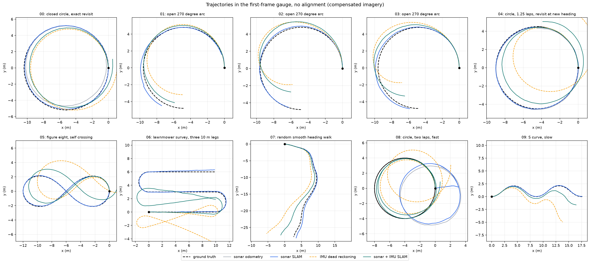
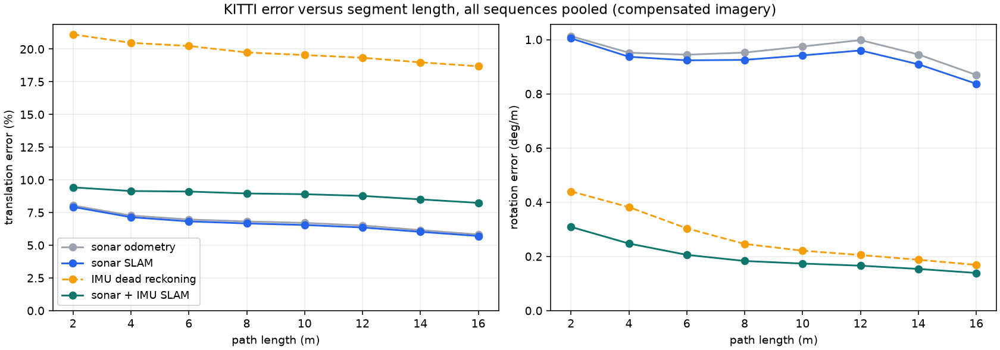
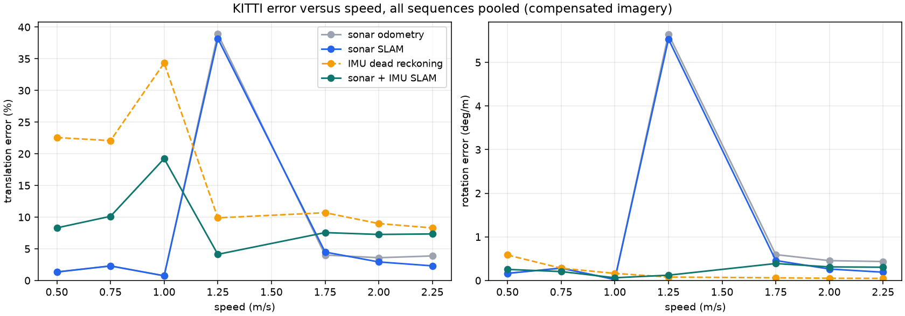
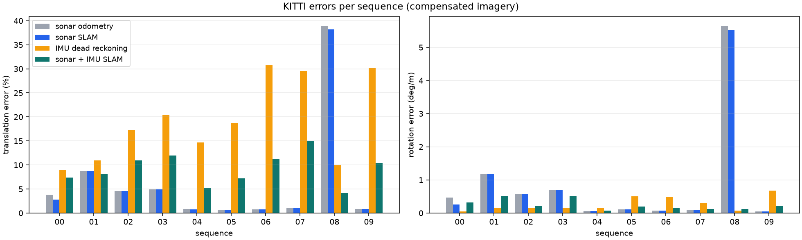
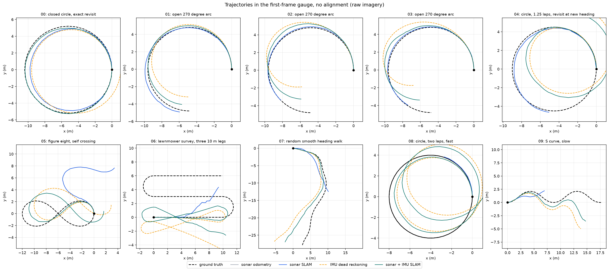

# Sonar SLAM on simulated sequences, KITTI odometry form (2026-09-16)

## Summary
Ten simulated forward-scan sonar sequences with exact ground truth (20 to 50 m,
37 to 132 pings, 0.6 to 2.3 m/s) were run through four estimators and scored
with the KITTI odometry metrics. Pose files are in the KITTI format so the
scores can be recomputed with the official devkit or `evo`.

With range-compensated imagery, sonar-only odometry reaches **0.66 to 1.02 %
translation error and 0.05 to 0.11 deg/m rotation error** on the five
forward-looking survey sequences at 0.6 to 0.9 m/s (04 to 07 and 09), with no
rejected scan pairs. The same estimator fails at 1.26 m/s (08: 38.9 %), where
IMU-aided SLAM holds 4.1 %. Over all 5,241 pooled segments the sonar SLAM score
is 6.79 % / 0.937 deg/m and the sonar-IMU score is 8.96 % / 0.208 deg/m.

Two findings matter more than the headline numbers. First, the earlier tests
ran on raw simulator output, whose 1/r^4 dynamic range starves the feature
detector; applying the range gain that every commercial sonar applies in
hardware cuts the pooled sonar-only error from 44.4 % to 6.9 %. Second, the
sonar-inertial fusion is worse than sonar alone at low speed because the IMU
edges are weighted as if unbiased. Both are diagnosed below with numbers.

These are synthetic, ideal-acoustic results. They test the estimator and its
implementation, not the simulator's physics and not real-sonar accuracy.

## Data format and metrics
- `results/dataset/poses/SS.txt`: ground truth, one 3x4 row-major pose per
  ping in the frame of the first ping (KITTI odometry layout); the planar
  SE(2) pose is embedded with z = 0. `results/dataset/sequences/SS/times.txt`
  holds seconds from the first ping.
- `results/results/CONDITION/METHOD/data/SS.txt`: estimates in the same layout.
- Metric: the KITTI devkit's `calcSequenceErrors`, ported to numpy in
  `kitti_odometry.py` and checked against analytic cases in `test_kitti.py`
  (9 tests). For every start ping and every segment length L in {2, 4, ...,
  16} m of ground-truth path, the error motion E = inv(delta_est) * delta_gt is
  formed; translation error is |t(E)| / L in percent and rotation error is
  angle(R(E)) / L in deg/m; scores are means over all segments. KITTI uses 100
  to 800 m because its drives are kilometres long; the lengths here are that
  set scaled by 1/50. Start step is one ping, and segment speed uses the real
  timestamps.
- Also reported: ATE, the position RMSE after rigid SE(2) alignment with no
  scale and no reflection, as in the earlier reports, and the stationary
  control (constant position after alignment, 3.9 to 9.2 m on these paths).

To verify independently:
```sh
pip install evo
evo_ape kitti results/dataset/poses/04.txt results/results/compensated/sonar_slam/data/04.txt -a
evo_rpe kitti results/dataset/poses/04.txt results/results/compensated/sonar_slam/data/04.txt -a --delta 4 --delta_unit m
```

## Sequences
All scenes are small spheres (radius 0.08 to 0.16 m) lying in the sonar's
horizontal plane; the sensor is level. Sonar: 1.2 MHz, 181 beams over 110
degrees, 360 range bins to 9 m, 14 degree vertical beamwidth, 0.4 s ping
period. Sequences 00 to 03 look inward at a cluster of 12 to 18 targets from a
circle or arc; 04 to 09 look forward along the path over a uniform target
field at 0.5 per square metre, none within 1 m of the path.

| Seq | Shape | Pings | Path (m) | Speed (m/s) | Targets | Source |
|---|---|---:|---:|---:|---:|---|
| 00 | closed circle, exact revisit | 37 | 32.6 | 2.27 | 12 | `demo19_slam.py` scene |
| 01 | open 270 degree arc | 81 | 22.6 | 0.71 | 18 | seed 91501, 2026-09-15 report |
| 02 | open 270 degree arc | 81 | 22.6 | 0.71 | 18 | seed 91502, 2026-09-15 report |
| 03 | open 270 degree arc | 81 | 22.6 | 0.71 | 18 | seed 91503, 2026-09-15 report |
| 04 | circle, 1.25 laps, revisit at a new heading | 126 | 35.3 | 0.71 | 146 | new |
| 05 | figure eight, self crossing | 121 | 31.5 | 0.66 | 130 | new |
| 06 | lawnmower survey, three 10 m legs | 132 | 39.3 | 0.74 | 142 | new |
| 07 | random smooth heading walk | 101 | 35.0 | 0.88 | 329 | new |
| 08 | circle, two laps, fast | 101 | 50.2 | 1.26 | 137 | new |
| 09 | S curve, slow | 81 | 20.0 | 0.62 | 155 | new |

## Methods
All four receive the same rendered pings, the same extracted features and the
same timestamps, and none reads ground truth. The estimators are the existing
code, unchanged.

1. **sonar odometry**: sequential mutual-nearest-neighbour ICP between
   consecutive pings with a constant-velocity initial guess
   (`SLAM/research/evaluate.py`, the estimator used on the DFKI ARIS data).
2. **sonar SLAM**: the same run after keyframe pose-graph optimisation with
   descriptor-proposed, ICP-verified loop closures; poses between keyframes
   are carried by the sequential odometry.
3. **IMU dead reckoning**: the synthetic planar IMU of `slam_experiment.py`
   (fixed accelerometer and gyro bias plus noise, seeded per sequence),
   integrated from the known initial pose and velocity.
4. **sonar + IMU SLAM**: `slam_experiment.py` fusion of IMU odometry edges,
   scan-matching edges and loop closures in the C++ robust pose graph.

## Results, compensated imagery (primary)
Cells are translation error % / rotation error deg/m / ATE m.

| Seq | Feat./ping | sonar odometry | sonar SLAM | IMU dead reckoning | sonar + IMU SLAM |
|---|---:|---:|---:|---:|---:|
| 00 | 24.2 | 3.82 / 0.465 / 0.411 | 2.82 / 0.252 / 0.107 | 8.86 / 0.050 / 0.335 | 7.36 / 0.319 / 0.405 |
| 01 | 16.5 | 8.70 / 1.179 / 0.499 | 8.70 / 1.179 / 0.499 | 10.96 / 0.146 / 0.467 | 8.03 / 0.515 / 0.228 |
| 02 | 16.4 | 4.58 / 0.560 / 0.209 | 4.58 / 0.560 / 0.209 | 17.22 / 0.157 / 0.690 | 10.95 / 0.207 / 0.416 |
| 03 | 16.8 | 4.94 / 0.703 / 0.225 | 4.94 / 0.703 / 0.225 | 20.35 / 0.142 / 0.696 | 11.95 / 0.515 / 0.382 |
| 04 | 22.8 | 0.83 / 0.065 / 0.037 | **0.78 / 0.054 / 0.036** | 14.72 / 0.151 / 1.120 | 5.23 / 0.074 / 0.369 |
| 05 | 23.2 | 0.66 / 0.105 / 0.041 | **0.66 / 0.105 / 0.041** | 18.72 / 0.506 / 1.570 | 7.20 / 0.198 / 0.627 |
| 06 | 21.9 | 0.72 / 0.069 / 0.074 | **0.72 / 0.069 / 0.074** | 30.73 / 0.493 / 3.457 | 11.28 / 0.153 / 1.233 |
| 07 | 28.3 | 1.02 / 0.079 / 0.115 | **1.02 / 0.079 / 0.115** | 29.53 / 0.296 / 0.729 | 14.99 / 0.120 / 0.363 |
| 08 | 23.7 | 38.90 / 5.645 / 3.087 | 38.20 / 5.533 / 3.024 | 9.89 / 0.078 / 1.060 | **4.13 / 0.121 / 0.306** |
| 09 | 24.0 | 0.87 / 0.050 / 0.029 | **0.87 / 0.050 / 0.029** | 30.15 / 0.673 / 0.967 | 10.33 / 0.213 / 0.372 |
| **all** | | 6.92 / 0.961 / 0.473 | **6.79 / 0.937 / 0.436** | 19.93 / 0.288 / 1.109 | 8.96 / 0.208 / 0.470 |

Loop closures accepted by sonar SLAM: 1 (00), 17 (04), 7 (08), none elsewhere;
the figure eight (05) crosses itself at a 90 degree heading difference, which
the image descriptor does not propose. Rejected scan pairs: 3 of 80 on 01, 37
of 100 on 08, none on the other eight sequences.









## Ablation, raw imagery (as in the earlier reports)

| Seq | Feat./ping | sonar odometry | sonar SLAM | IMU dead reckoning | sonar + IMU SLAM |
|---|---:|---:|---:|---:|---:|
| 00 | 10.5 | 18.04 / 1.896 / 1.146 | 18.04 / 1.896 / 1.146 | 8.86 / 0.050 / 0.335 | 3.42 / 0.182 / 0.071 |
| 01 | 12.3 | 4.59 / 0.671 / 0.258 | 4.59 / 0.671 / 0.258 | 10.96 / 0.146 / 0.467 | 7.30 / 0.410 / 0.221 |
| 02 | 10.2 | 12.61 / 1.535 / 0.714 | 12.61 / 1.535 / 0.714 | 17.22 / 0.157 / 0.690 | 9.50 / 0.290 / 0.324 |
| 03 | 13.9 | 17.93 / 2.105 / 0.858 | 17.93 / 2.105 / 0.858 | 20.35 / 0.142 / 0.696 | 11.45 / 0.292 / 0.398 |
| 04 | 6.8 | 44.31 / 5.933 / 3.530 | 44.31 / 5.933 / 3.530 | 14.72 / 0.151 / 1.120 | 10.03 / 0.152 / 0.874 |
| 05 | 8.2 | 40.79 / 5.898 / 3.521 | 40.79 / 5.898 / 3.521 | 18.72 / 0.506 / 1.570 | 10.83 / 0.350 / 0.868 |
| 06 | 5.8 | 64.68 / 9.909 / 3.860 | 64.68 / 9.909 / 3.860 | 30.73 / 0.493 / 3.457 | 23.92 / 0.356 / 2.689 |
| 07 | 7.7 | 49.84 / 1.746 / 4.301 | 49.84 / 1.746 / 4.301 | 29.53 / 0.296 / 0.729 | 19.37 / 0.243 / 0.522 |
| 08 | 7.4 | 74.07 / 12.516 / 3.925 | 74.07 / 12.516 / 3.925 | 9.89 / 0.078 / 1.060 | 7.54 / 0.082 / 0.819 |
| 09 | 6.1 | 63.22 / 5.772 / 3.244 | 63.22 / 5.772 / 3.244 | 30.15 / 0.673 / 0.967 | 21.97 / 0.490 / 0.805 |
| **all** | | 44.37 / 5.727 / 2.536 | 44.37 / 5.727 / 2.536 | 19.93 / 0.288 / 1.109 | 13.44 / 0.275 / 0.759 |

The raw rows for 01 to 03 reproduce the 2026-09-15 geometry-validation ATEs
(0.258, 0.714, 0.858 m) to the printed digits, and `test_benchmark.py` asserts
the first to six decimals. The raw row for 00 is the `demo19_slam.py`
experiment: its published 0.987 to 0.149 m figures are unaligned RMSE in the
truth gauge, whereas ATE here is after alignment, so the two are not directly
comparable; the same run reproduces the published numbers exactly through
`python/demo19_slam.py`.



## Findings

### 1. Range compensation is the difference between failure and success
The core attenuates returns by 1/r^4 and by Thorp absorption (440 dB/km at
1.2 MHz, 7.9 dB two-way at 9 m). The feature extractor keeps local maxima above
2.5 % of the ping's brightest pixel, so whenever one target is within about
2.5 times the range of another, the farther one is discarded. On the survey
sequences the raw pings yield 6 to 8 features and 40 to 90 % of consecutive
scan pairs are rejected; compensated pings yield 22 to 28 features and none
are rejected (04 to 07, 09). Real sonars apply this gain before logging, so
the compensated condition is the closer analogue of the ARIS imagery used in
the external evaluation. `imaging.py` inverts the core's per-ray loss; a
residual factor of about 3.6 remains between equal spheres at 2 and 8 m
because a nearer sphere spans more elevation sub-rays (checked in
`test_benchmark.py`).

### 2. Sonar-only odometry has a speed limit set by the ICP gate
At 0.5 m per ping (08, 1.26 m/s) the 0.6 m correspondence gate and a zero
initial guess reject the first five pairs, then accept a wrong association
(estimated step 0.78 m at 10 degrees against a true 0.50 m at 94 degrees),
and the constant-velocity prior propagates it. The IMU-initialised fusion
scores 4.1 % on the same pings. Sequence 00 at 0.9 m per ping survives only
because its inward-looking geometry keeps the same 12 targets in view.

### 3. The fusion is weighted as if the IMU were unbiased
On 06 the IMU's per-ping relative translation error grows from a median of
0.044 m in the first third to 0.148 m in the last third (maximum 0.194 m),
while the graph declares a fixed 0.09 m sigma per IMU edge and uses the ICP
residual (median 0.064 m) as the scan-edge sigma. With comparable weights the
optimum follows the biased IMU chain, so sonar + IMU SLAM lands between the
two inputs (5 to 15 %) instead of at the better one (below 1 %). The remedy is
standard: estimate the bias states or grow the IMU sigma with integration
time. It was not applied here because the protocol froze the estimators.

### 4. Loop closures help where they are proposed
Sonar SLAM improves on odometry only on 00, 04 and 08, the sequences where the
descriptor proposed closures. On 04, 17 closures reduce ATE from 0.037 to
0.036 m; they are nearly redundant because the odometry is already accurate.
The 90 degree crossing in 05 and the 3 m separated legs of 06 yield no
accepted closures: the coarse bearing-range descriptor is not rotation
invariant, and the lawnmower legs view the same targets from opposite
headings.

## Development record
Two earlier runs of this benchmark were discarded, and the reasons are in
`PROTOCOL.md`, Amendments. Run 1 had the sonar side-looking by a frame
convention error. Run 2 used sparse roadside scenes with raw imagery and
failed on every new sequence for the dynamic-range reason above; that failure
is what led to the compensated condition and the uniform target field.
Sequences 00 to 03, the raw condition and all four estimators are unchanged
from the earlier reports.

## Limitations
- Synthetic, deterministic, ideal-acoustic scenes: no speckle, multipath,
  clutter, occlusion by terrain, or vehicle roll and pitch. The benchmark
  exercises the SLAM code, not the acoustic model.
- Planar SE(2) geometry with all targets in the sensor plane; the elevation
  ambiguity of a real forward-scan sonar is not tested.
- The IMU is a synthetic planar model with fixed bias; no real inertial data
  were used.
- Ten sequences, each run once (the estimators are deterministic). Per-sequence
  scores are single measurements, not distributions.
- KITTI lengths were scaled to the 20 to 50 m sequences; the numbers are not
  comparable to KITTI vehicle leaderboards.
- None of this validates the physical bearing convention or accuracy on real
  ARIS or Oculus recordings; see `SLAM/geometry_validation_20260915` for what
  remains open there.

## Reproduce
From the repository root, after building the extension (root README):
```sh
.venv/bin/python SLAM/kitti_benchmark_20260916/test_kitti.py
.venv/bin/python SLAM/kitti_benchmark_20260916/test_benchmark.py
.venv/bin/python SLAM/kitti_benchmark_20260916/run_benchmark.py
```
The run takes about 25 s and rewrites `results/` deterministically;
`results/metrics.json` records the environment, git commit and protocol hash.
