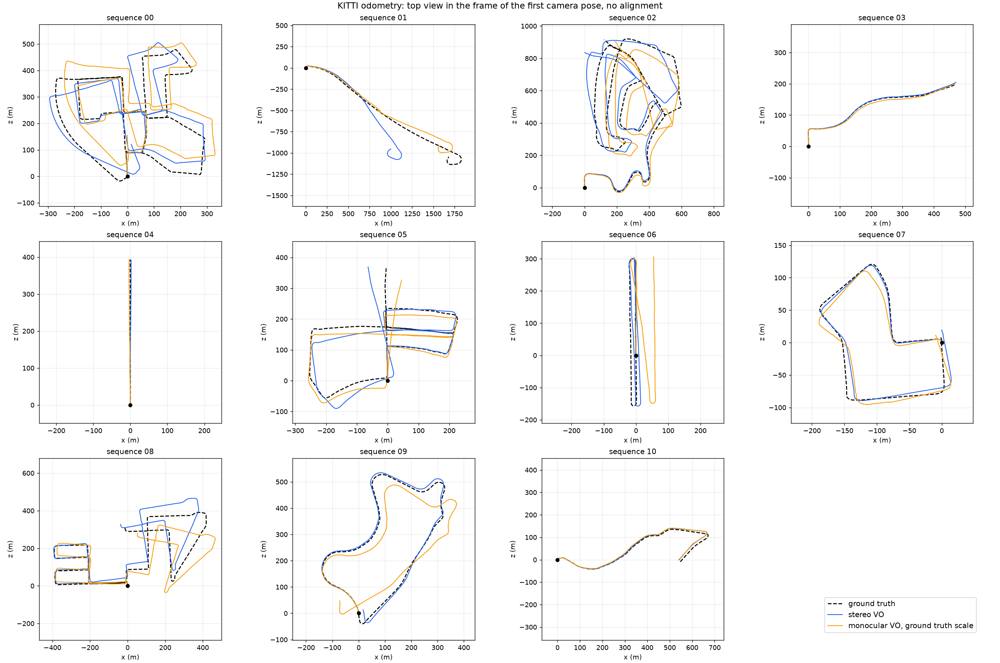
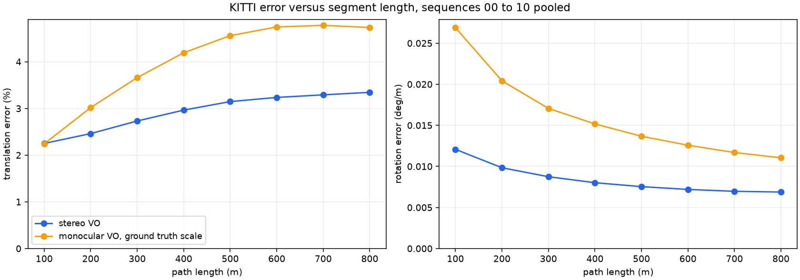
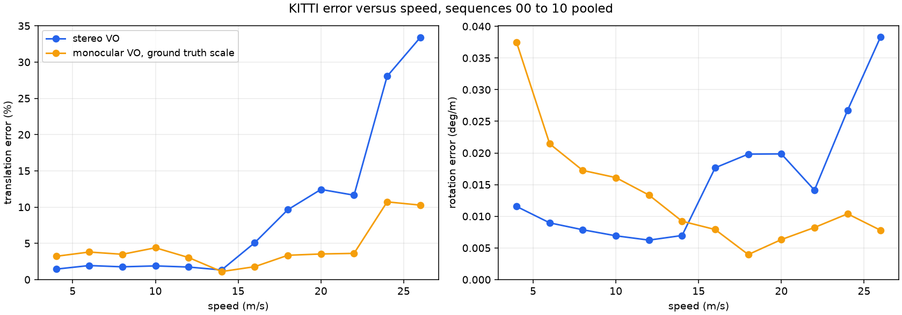
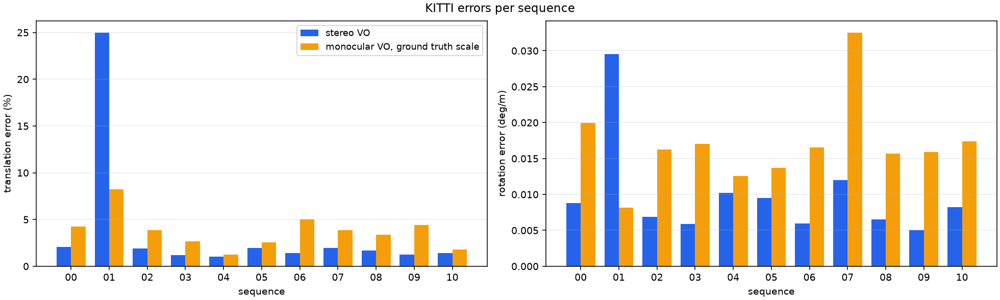

# Visual odometry assessment on the KITTI odometry benchmark (2026-09-18)

## Purpose
Dr. Negahdaripour's guidance was to assess the code on available optical
datasets with ground truth before applying it to his optical data. The
existing pipeline was sonar only, so this folder adds a camera front end
and assesses it on the KITTI odometry benchmark (Geiger, Lenz and Urtasun,
CVPR 2012), the reference dataset with ground truth for this task, using the
benchmark's own metric so the numbers sit directly beside published systems.
The front end takes any calibrated image sequence, monocular or stereo, and
returns camera poses; KITTI is the check that it works before it is run on
his data.

## Summary
Eleven sequences, 23,201 stereo pairs, 22.2 km of driving with GPS/INS
ground truth. Two methods, both frame to frame, no keyframes, no bundle
adjustment, no loop closure:

| Method | Translation error | Rotation error | Segments |
|---|---:|---:|---:|
| Stereo visual odometry | 2.88 % | 0.86 deg/100 m | 14,567 |
| Stereo VO, sequences other than 01 | 1.01 to 2.06 % per sequence | 0.50 to 1.20 deg/100 m | |
| Monocular VO, scale from ground truth | 3.89 % | 1.67 deg/100 m | 14,567 |
| ORB SLAM2 stereo (Mur-Artal and Tardos, T-RO 2017), for reference | 0.72 % mean of Table I | 0.22 deg/100 m | |
| Stereo LSD-SLAM (same table), for reference | 0.91 % mean of Table I | 0.27 deg/100 m | |

Stereo VO holds 1.0 to 2.1 % translation error on ten of the eleven
sequences, the range expected of a frame to frame stereo method without
optimisation (libviso2 class), and fails on sequence 01, the highway drive:
above 16 m/s the ICP style frame to frame matching loses close points and
the error rises from under 2 % to over 10 %. Rotation error is three to four
times that of full SLAM systems because nothing here averages over more than
two frames. These are real camera images with real ground truth; nothing is
simulated.

## Data
KITTI odometry grayscale stereo, sequences 00 to 10 (the eleven with public
ground truth), archive MD5 `7e765daeef0a542aeb1a38c2cb799558`. Camera 0 and
camera 1, rectified, 1226 to 1241 by 370 to 376 pixels at 10 Hz, baseline
0.537 m from `calib.txt`. Ground truth is read only by the scorer, after estimation, and
for the monocular method to set the length of each step after its direction
has been estimated.

| Seq | Frames | Path (m) | Duration (s) | Mean speed (m/s) | Environment |
|---|---:|---:|---:|---:|---|
| 00 | 4541 | 3724 | 471 | 7.9 | residential, many loops |
| 01 | 1101 | 2453 | 114 | 21.5 | highway |
| 02 | 4661 | 5067 | 483 | 10.5 | residential and country |
| 03 | 801 | 561 | 83 | 6.8 | country road |
| 04 | 271 | 394 | 28 | 14.1 | straight urban road |
| 05 | 2761 | 2206 | 288 | 7.7 | residential, loops |
| 06 | 1101 | 1233 | 114 | 10.8 | residential, one loop |
| 07 | 1101 | 695 | 114 | 6.1 | residential, one loop |
| 08 | 4071 | 3223 | 423 | 7.6 | residential and city |
| 09 | 1591 | 1705 | 165 | 10.3 | country and residential |
| 10 | 1201 | 920 | 124 | 7.4 | residential |

## Methods
All settings were fixed after a check on the first 300 frames of sequence
08 only, as the protocol records, and applied unchanged to all sequences.

1. **Stereo visual odometry** (`stereo_vo.py`). ORB features on the left
   image (4000 candidates, the strongest 60 kept in each of 12 by 4 grid
   cells, about 1,450 per frame). Stereo depth by block matching along the
   rectified row: an 11 by 11 patch, normalised cross correlation over a
   128 pixel disparity range, parabolic sub pixel refinement, a right to
   left consistency check within one pixel, depths to 80 m (about 1,150
   points per frame). Temporal correspondences by ORB descriptor matching
   with a 0.8 ratio test. Relative motion by PnP with RANSAC (1 px
   reprojection gate, 500 iterations) on the previous frame's 3D points and
   the current frame's 2D features, initialised by the previous motion, then
   refined by Huber weighted least squares of the reprojection error into
   both current images. If fewer than 12 inliers remain the previous motion
   is repeated and the event is counted (7 such frames, all in sequence 01).
2. **Monocular visual odometry, ground truth scale**. The same left image
   features; relative rotation and translation direction from the five
   point essential matrix with RANSAC and `recoverPose`; the length of each
   step is taken from ground truth, which is the standard way monocular
   methods are scored on KITTI and is stated wherever the numbers appear.
   This isolates rotation and heading accuracy from the scale that a single
   camera cannot observe.

Both write poses in the KITTI layout (`results/results/METHOD/data/SS.txt`)
so the official devkit or `evo` can rescore them.

## Metric
The KITTI devkit metric, ported to numpy in
`SLAM/kitti_benchmark_20260916/kitti_odometry.py` and checked by 10 unit
tests: for every tenth start frame and every segment length in {100, 200,
..., 800} m, the error motion between the estimated and true relative
transforms; translation error as a percentage of the length, rotation error
in degrees per metre, averaged over all segments of a sequence and over all
14,567 segments of the benchmark. Rotation is quoted below in deg/100 m to
match the published tables. ATE is the position RMSE after rigid SE(3)
alignment of the whole trajectory; without loop closure it grows with
sequence length and is reported for completeness.

## Results

| Seq | Stereo t (%) | Stereo r (deg/100 m) | Stereo ATE (m) | Mono t (%) | Mono r (deg/100 m) | ORB SLAM2 stereo t / r | Stereo LSD t / r |
|---|---:|---:|---:|---:|---:|---:|---:|
| 00 | 2.06 | 0.88 | 17.8 | 4.25 | 1.99 | 0.70 / 0.25 | 0.63 / 0.26 |
| 01 | 25.00 | 2.96 | 239.9 | 8.21 | 0.81 | 1.39 / 0.21 | 2.36 / 0.36 |
| 02 | 1.91 | 0.69 | 32.7 | 3.85 | 1.63 | 0.76 / 0.23 | 0.79 / 0.23 |
| 03 | 1.22 | 0.59 | 1.2 | 2.67 | 1.71 | 0.71 / 0.18 | 1.01 / 0.28 |
| 04 | 1.01 | 1.02 | 0.9 | 1.24 | 1.25 | 0.48 / 0.13 | 0.38 / 0.31 |
| 05 | 1.94 | 0.95 | 11.3 | 2.56 | 1.37 | 0.40 / 0.16 | 0.64 / 0.18 |
| 06 | 1.39 | 0.60 | 2.7 | 4.99 | 1.65 | 0.51 / 0.15 | 0.71 / 0.18 |
| 07 | 1.97 | 1.20 | 3.6 | 3.89 | 3.25 | 0.50 / 0.28 | 0.56 / 0.29 |
| 08 | 1.66 | 0.65 | 9.8 | 3.39 | 1.57 | 1.05 / 0.32 | 1.11 / 0.31 |
| 09 | 1.26 | 0.50 | 5.5 | 4.41 | 1.59 | 0.87 / 0.27 | 1.14 / 0.25 |
| 10 | 1.42 | 0.83 | 3.3 | 1.78 | 1.74 | 0.60 / 0.27 | 0.72 / 0.33 |
| all | 2.88 | 0.86 | 29.9 | 3.89 | 1.67 | 0.72 / 0.22 | 0.91 / 0.27 |

Published columns are quoted from Table I of Mur-Artal and Tardos, "ORB-SLAM2:
an open-source SLAM system for monocular, stereo and RGB-D cameras", IEEE
Transactions on Robotics 33(5), 2017; both are full SLAM systems with
keyframe optimisation and loop closing, so they bound what the same images
allow rather than being like for like baselines. Per frame cost of the
stereo method is about 160 ms single threaded (ORB, block matching, PnP and
refinement in Python and OpenCV), 320 to 500 ms when eight sequences run in
parallel on a ten core laptop.









## Findings

**Speed, not scene, is what breaks frame to frame stereo VO.** Pooled over
all sequences the stereo translation error is 1.3 to 1.9 % at every speed
below 15 m/s and 5 to 33 % above 16 m/s; only sequence 01 drives that fast.
At 25 m/s the car covers 2.5 m per frame, close points leave the field of
view within a few frames, the median inlier count drops to 53 (215 of its
1,100 frames have fewer than 30), and the 1 px RANSAC gate with a 0.8 ratio
test has too little to work with. ORB SLAM2 survives the same sequence by
tracking far points over many frames in bundle adjustment.

**Translation error grows with segment length, rotation error falls.**
Stereo translation error rises from 2.25 % at 100 m to 3.35 % at 800 m,
the signature of heading drift accumulating without loop closure; rotation
error per metre falls from 1.21 to 0.69 deg/100 m because uncorrelated
per frame rotation noise averages out over longer segments.

**Monocular heading is nearly as good as stereo where motion is smooth.**
With scale supplied, monocular error is within 0.2 to 1.5 percentage points
of stereo on the country and straight sequences (03, 04, 05, 10) and two to
four times worse on the sequences with frequent turns (00, 02, 06 to 09),
because the five point solver is weakest exactly when the translation
direction changes.
On the highway it beats stereo (8.2 against 25 %) since it never depends on
close points. The monocular rotation error of 0.8 to 3.3 deg/100 m is the
figure relevant to single camera underwater video.

**Sequence 08 ground truth.** The first 120 frames of the published ground
truth for 08 carry a vertical drift of about 0.19 m per frame that the car
cannot have made; every published number on 08 includes it, and so does
ours.

## What this establishes for the optical data
The front end runs on any calibrated image sequence: intrinsics (fx, fy,
cx, cy and distortion) and, for stereo, the baseline. For monocular video
it returns rotation and translation direction per frame; metric scale needs
a second camera, a known baseline, a range sensor, or one known distance in
the scene. To run it on Dr. Negahdaripour's optical data I need the frames
or video, the camera calibration (or a calibration target sequence), the
frame rate, and whatever reference motion exists; the same scorer then
produces the same tables. A monocular sequence without reference motion can
still be assessed for loop consistency and reprojection residuals, but not
for absolute error.

Also on disk and queued: 3,068 underwater GoPro Hero 8 frames from five
DFKI UXO tank recordings with gantry ground truth and the publisher's camera
calibration. Their motion is 2 to 3 m at 5 cm/s with the gimbal panning 130
degrees, so they exercise rotation rather than odometry; they are the
closest public underwater optical check and will be reported separately.

## Limitations
- Frame to frame odometry only: no keyframes, bundle adjustment, or loop
  closure, so drift is unbounded and ATE grows with sequence length.
- Parameters were fixed on 300 frames of sequence 08 before the run; no
  tuning after seeing results, and nothing was rerun.
- The monocular method's scale comes from ground truth and its numbers must
  not be read as a self contained monocular system.
- Runtime is Python and OpenCV, not real time at 10 Hz on one core.
- KITTI is a road dataset: textured scenes, long baselines between frames,
  daylight. Underwater imagery has lower texture, backscatter, and attenuation,
  none of which this assessment exercises.

## Reproduce
```sh
pip install -r requirements-optical-benchmark.txt
mkdir -p data_external/kitti_odometry && cd data_external/kitti_odometry
for f in data_odometry_gray.zip data_odometry_poses.zip data_odometry_calib.zip; do
  curl -L -O https://s3.eu-central-1.amazonaws.com/avg-kitti/$f && unzip -q -o $f
done
cd ../..
.venv/bin/python SLAM/optical_benchmark_20260918/test_vo.py
.venv/bin/python SLAM/optical_benchmark_20260918/run_kitti.py --workers 8
```
The run writes `results/` (about 25 minutes with eight workers) and
`results/metrics.json` records the environment, git commit, archive MD5 and
protocol hash. `--plot-only` redraws the figures from saved pose files.
