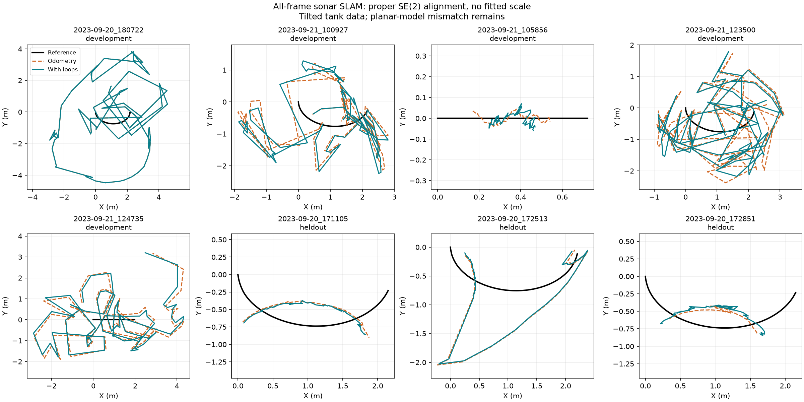
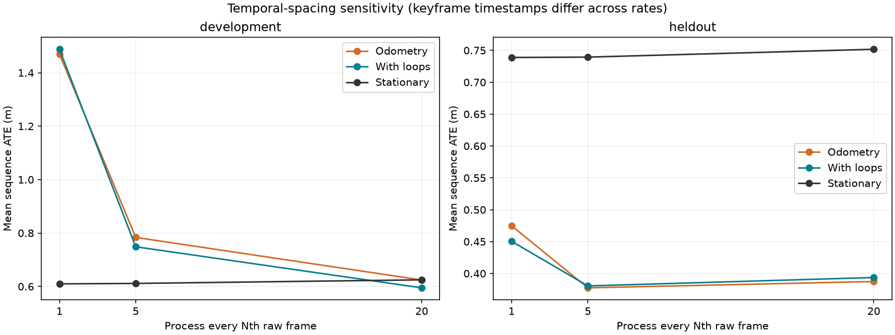

# External sonar SLAM evaluation

## Conclusion

The current adapter does **not yet validate** sonar SLAM on these real ARIS recordings. Dense results are inconsistent, and physical bearing handedness remains unresolved. The original frozen results are retained as conditional baseline measurements; they must not be presented as definitive algorithm accuracy or simulator-physics validation.

Processed 5,233 distinct real sonar frames in eight complete sequences. Five recordings are development data; three were selected before their imagery or errors were read. Each ran at three frame spacings, with paired before/after loop-closure scores: 24 configurations. The three new recordings are the same object and site, so they do not establish cross-site generalization.

## All-frame result

| Split / recording | Odometry ATE (m) | With loops (m) | Stationary (m) | Loops | 1 s translation RPE (m) |
|---|---:|---:|---:|---:|---:|
| development / 2023-09-20_180722 | 2.888 | 2.888 | 0.762 | 0 | 1.771 |
| development / 2023-09-21_100927 | 1.277 | 1.345 | 0.735 | 6 | 0.913 |
| development / 2023-09-21_105856 | 0.105 | 0.149 | 0.213 | 69 | 0.032 |
| development / 2023-09-21_123500 | 1.391 | 1.368 | 0.758 | 7 | 1.208 |
| development / 2023-09-21_124735 | 1.687 | 1.689 | 0.581 | 7 | 1.307 |
| heldout / 2023-09-20_171105 | 0.336 | 0.345 | 0.728 | 69 | 0.100 |
| heldout / 2023-09-20_172513 | 0.602 | 0.591 | 0.760 | 39 | 0.251 |
| heldout / 2023-09-20_172851 | 0.487 | 0.416 | 0.729 | 69 | 0.094 |

development: odometry beats stationary on 1/5 sequences; with loops beats stationary on 1/5. Loops worsen ATE on 3/4 runs that accepted loops.

heldout: odometry beats stationary on 3/3 sequences; with loops beats stationary on 3/3. Loops worsen ATE on 1/3 runs that accepted loops.

## What makes this a stronger test

- Complete raw sequences, fixed settings, real published reference motion, and explicitly separated development/test recordings.
- Odometry versus loop closure; three temporal spacings; fixed-time translation and yaw RPE; stationary controls; explicit failures and constraints.
- Known-transform recovery, pose composition against C++, accelerated-loader equivalence including tied maxima, and a reference-field poisoning test.
- Input hashes, member CRC validation for all new files, source snapshots, and independent homogeneous calibration composition.
- Sequence-level uncertainty summaries rather than treating thousands of correlated frames as independent trials. The estimator is deterministic; repeating identical runs is not a new experiment.

## Geometry and timing audit

The range bins use round-trip travel time and measured sound speed. Nonuniform ARIS beam centers are retained. The adapter follows the publisher’s final polar2 display mapping, x = r sin(bearing), forward = r cos(bearing). However, the raw viewer explicitly describes beams as right-to-left and flips them. Display orientation alone does not certify physical x-right handedness. A known off-axis target calibration is still required to settle that convention. The reference chain includes the fixed mounting quaternion, gimbal xyz Euler rotation, and rotated -0.108725 m lever arm. Independent homogeneous composition agrees numerically with the scorer. This checks implementation against the published model, not the hardware calibration itself.

Tilts of 22–60 degrees violate a horizontal-plane interpretation. For a zero-elevation central ray, horizontal forward displacement is r cos(tilt), i.e. approximately 0.93r to 0.50r. This is a geometry diagnostic, not a valid blanket correction for unknown 3-D scene elevation. ATE and horizontal RPE therefore describe an intentionally mismatched planar baseline.

Shifting scoring reference timestamps by ±0.1 s, excluding boundary frames, changed all-frame post-loop ATE by at most 0.0001 m. This is a local sensitivity analysis, not a measured synchronization uncertainty or validation.

## Temporal spacing

Dense processing can accumulate registration bias and jitter. Accepted matches do not imply correct motion. Loop proposals in this object-centric dataset can repeatedly match the same object from a different viewpoint, rather than establish a true revisit. Keyframe selection and the legacy 12-keyframe separation vary with stride, so the spacing experiment changes the complete pipeline; it does not isolate only ICP frame spacing.

## Descriptive uncertainty

| Split | Paired contrast (positive is worse) | Mean difference (m) | Sequence bootstrap 95% interval (m) |
|---|---|---:|---|
| development | loop_minus_odometry | 0.018 | [-0.009, 0.045] |
| development | odometry_minus_stationary | 0.860 | [0.282, 1.529] |
| heldout | loop_minus_odometry | -0.024 | [-0.071, 0.009] |
| heldout | odometry_minus_stationary | -0.264 | [-0.392, -0.158] |

Only five development and three same-object held-out sequences support these descriptive intervals. The iid sequence assumption is weak because sequences share a tank and targets. Do not present these intervals as population-level significance. No parameters were selected using these held-out scores.

## Post-hoc bearing-direction diagnostic

[Bearing diagnostic](bearing_sign_diagnostic.json) prescribes a reversal of estimated x before proper SE(2) scoring. It is an algebraic diagnostic, not a newly run or validated estimator. It improves some recordings and worsens others. No best-sign score replaces the frozen results. This check was added after seeing mirrored-looking paths, so it is explicitly exploratory; these held-out recordings cannot be reused as untouched tests for a future adapter correction.

## Remaining work before a PhD-level validation claim

1. Resolve physical bearing handedness with an off-axis target and resolve the tilted imaging geometry in the state/measurement model, or acquire a truly compatible planar benchmark. Adding reference orientations to estimation must be labeled sensor-aided and must use a legitimate measured input.
2. Develop and calibrate correspondence rejection and loop verification on development data, then freeze a new protocol and use fresh held-out objects/sites. These three test recordings are now consumed for any future tuning.
3. Compare against an independently implemented published sonar SLAM baseline with matching sensor assumptions; evaluate map consistency and long revisits, not just short object scans.
4. Validate simulator acoustics separately using controlled geometry, image statistics, and repeat measurements. This experiment tests SLAM on external imagery; it does not validate sound propagation.
5. Test actual synchronized IMU/sonar data for an inertial-fusion claim. None was synthesized from truth here.

## Reproducibility and sources

[Protocol](PROTOCOL.md), [commands](README.md), [all numerical results](all_metrics.csv), [sequence bootstrap](sequence_bootstrap.json), [timestamp sensitivity](time_shift_sensitivity.json). Per-run folders retain trajectories, loop measurements, input hashes, and source snapshots.

Dataset: Dahn et al., *An Acoustic and Optical Dataset for the Perception of Underwater Unexploded Ordnance (UXO)*, OCEANS 2024, [DOI](https://doi.org/10.1109/OCEANS55160.2024.10754316), [data](https://zenodo.org/records/13778485), [publisher code](https://github.com/dfki-ric/uxo-dataset2024). This is not a verified Negahdaripour/Woods benchmark. No professor email was sent.
